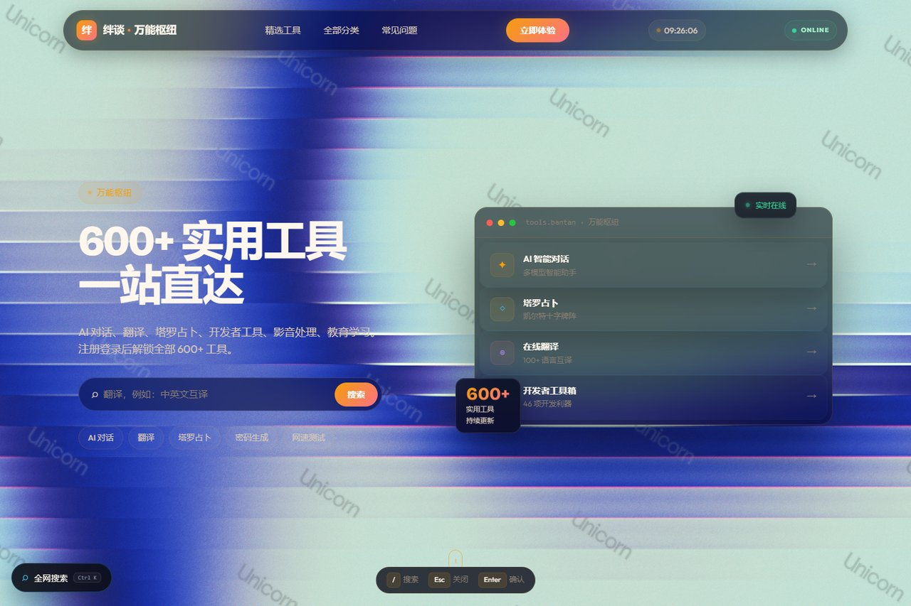
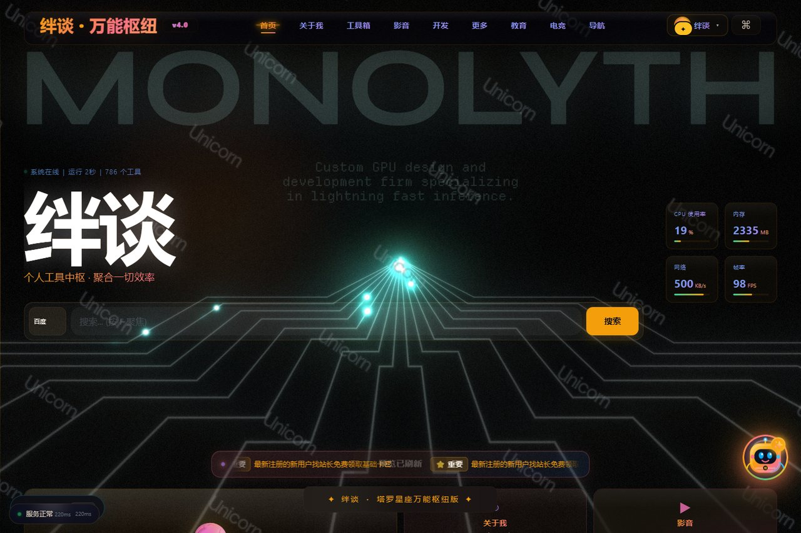
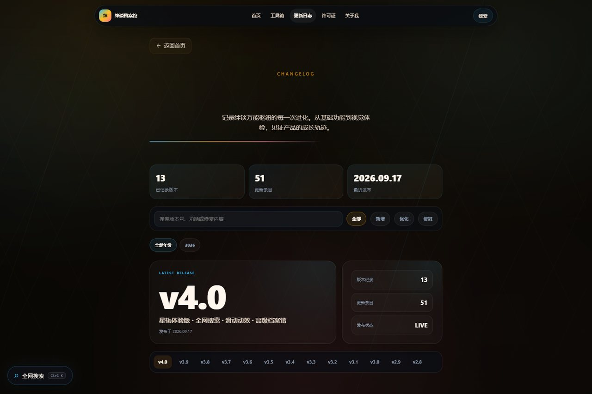
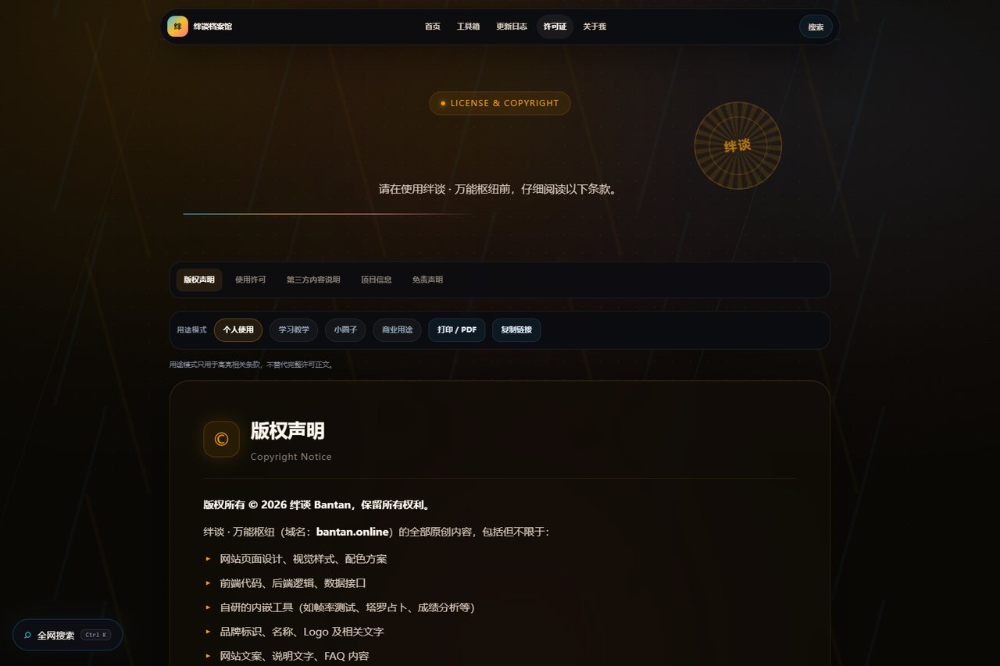
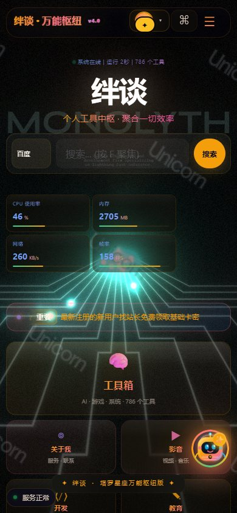

# 绊谈 · 万能枢纽


绊谈（Bantan）是一个中文在线工具聚合与导航平台，提供 **786 个可用工具**，覆盖 AI 对话、全网搜索、在线翻译、开发者工具、教育学习、影音娱乐、电竞优化、生活工具和实用计算等场景。

项目采用原生 HTML、CSS 和 JavaScript 构建，包含完整前台、PWA 支持、用户中心、AI 小绊谈、动态背景、交互式工具导航、更新日志、许可证和独立“关于我”播客页面。

[项目说明](#项目结构) · [贡献规范](./CONTRIBUTING.md) · [安全政策](./SECURITY.md) · [隐私说明](./PRIVACY.md) · [架构文档](./ARCHITECTURE.md) · [部署文档](./DEPLOYMENT.md) · [设计规范](./docs/DESIGN-SYSTEM.md) · [常见问题](./docs/FAQ.md) · [治理说明](./GOVERNANCE.md) · [版本发布](./RELEASE.md) · [更新日志](./CHANGELOG.md) · [使用许可](./LICENSE)

## 项目预览

| 入口页 | 万能枢纽 |
|---|---|
|  |  |

| 关于我 | 数字档案馆 |
|---|---|
|  |  |

| 使用许可 | 移动端 |
|---|---|
|  |  |

## 主要功能

- **786 个工具入口**：包含 650 个外链工具卡和 136 个内置工具
- **万能枢纽搜索**：支持百度、Bing、Google、知乎、B站、GitHub、淘宝、Steam 等网站
- **AI 小绊谈**：本地知识库、站点智能助手和自定义 API 模式
- **开发者工具**：实时预览、JWT 解码、正则测试、哈希生成、Base64、JSON 格式化
- **学习与效率工具**：科学计算、GPA、考试倒计时、课程表、学习计划、错题本
- **生活工具**：BMI、单位换算、世界时钟、房贷计算、纪念日、年龄计算
- **电竞工具**：帧率测试、输入延迟、鼠标轮询率、屏幕刷新率、坏点检测
- **用户中心 2.0**：头像工坊、个人签名、渐变背景、边框和挂件设置
- **独立档案馆**：更新日志和许可证页面支持筛选、展开、阅读进度与打印
- **个人播客主页**：`about.html` 展示绊谈、小绊谈、远程电脑优化和联系方式
- **PWA 支持**：Service Worker 离线缓存、Manifest 和添加到主屏幕
- **自适应布局**：适配桌面、平板、Android、iPhone、微信和 Edge 浏览器

## 页面入口

| 页面 | 文件 | 用途 |
|---|---|---|
| 入口页 | `landing.html` | 未登录用户介绍、登录和注册入口 |
| 万能枢纽 | `index.html` | 登录后主应用、工具导航和 AI 助手 |
| 关于我 | `about.html` | 个人播客、小绊谈和服务介绍 |
| 更新日志 | `changelog.html` | 版本记录、发布控制和版本筛选 |
| 使用许可 | `license.html` | 版权声明、使用范围和免责声明 |
| 404 页面 | `404.html` | 迷航提示和站内搜索入口 |

## 项目结构

```text
BNATAN7/
├─ index.html                  # 登录后主应用
├─ landing.html                # 未登录入口页
├─ about.html                  # 个人播客主页
├─ changelog.html              # 更新日志
├─ license.html                # 使用许可
├─ 404.html                    # 错误页面
├─ experience-v4.css/js        # 全站体验、搜索、移动适配
├─ reactbits-v4.css/js         # 文本、背景和数字动效
├─ uiverse-v4.css/js           # 输入框、开关和加载效果
├─ advanced-motion-v4.css/js   # 首页滚动和交互动效
├─ ui-interactions-v4.css/js   # 点击、磁吸、提示和预览
├─ profile-center.css/js       # 用户中心和头像工坊
├─ mascot-state.css/js         # 小绊谈状态形象
├─ legacy-tools.js             # 经典内置工具
├─ archive-v5.css/js           # 档案馆交互
├─ confirm-dialog.css/js       # 统一确认弹窗
├─ sw.js                       # Service Worker
├─ manifest.json               # PWA 配置
├─ llms.txt                    # AI 与搜索引擎说明、许可证摘要
├─ LICENSE                     # 绊谈专有许可证
└─ SVG、SEO、图标和静态资源
```

## 本地运行

项目是静态网站，但 `Service Worker`、页面跳转和相对资源需要通过 HTTP 服务访问，不建议直接双击 HTML 文件。

使用 Python：

```bash
python -m http.server 8000
```

然后打开：

```text
http://localhost:8000/landing.html
```

如果使用 Node.js，也可以启动任意静态文件服务器。

## 用户状态

完整枢纽内容需要登录后访问。未登录访问 `index.html` 会跳转到 `landing.html`。

登录状态由浏览器本地令牌和用户信息控制。后台、VIP、用户注册、API、KV 和用户数据逻辑不属于前台视觉升级范围，不应在前端重构中被随意修改。

## PWA 与缓存

- Service Worker：`sw.js`
- Manifest：`manifest.json`
- 当前缓存版本：`bantan-static-v4.0.4`

发布新版本后，应同时更新静态资源版本号，避免浏览器继续使用旧版 JavaScript 或 CSS。

## SEO 与 AI 说明

- `robots.txt`：搜索引擎抓取规则
- `sitemap.xml`：网站页面地图
- `llms.txt`：AI 系统、搜索引擎和许可证摘要
- 结构化数据：首页包含 `WebSite`、`SoftwareApplication`、`FAQPage` JSON-LD

## 部署

以下文件适合部署到静态托管平台：

```text
*.html
*.css
*.js
*.svg
*.png
*.ico
*.json
*.xml
*.txt
```

部署前应确认：

1. 域名和相对路径正确
2. `sw.js` 与所有资源已经更新
3. `LICENSE`、`llms.txt`、`manifest.json` 和 `robots.txt` 可访问
4. 微信、Android Edge、iPhone Safari 和桌面浏览器均完成复核
5. 后台、VIP、注册登录和用户接口不被前台文件覆盖

## 许可证

本项目使用 **绊谈专有许可证（Bantan Proprietary License）**。

- 允许个人使用、学习参考和小范围分享
- 禁止商业使用、二次分发、公开发布和移除品牌标识
- 具体权利义务以仓库根目录的 [LICENSE](./LICENSE) 为准

Copyright (c) 2026 绊谈 Bantan. All Rights Reserved.

## 联系方式

- 官方网站：https://bantan.online/
- 邮箱：g125668039@163.com
- 微信：HQUGH16FHJ
